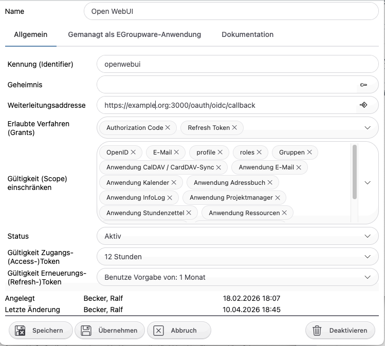
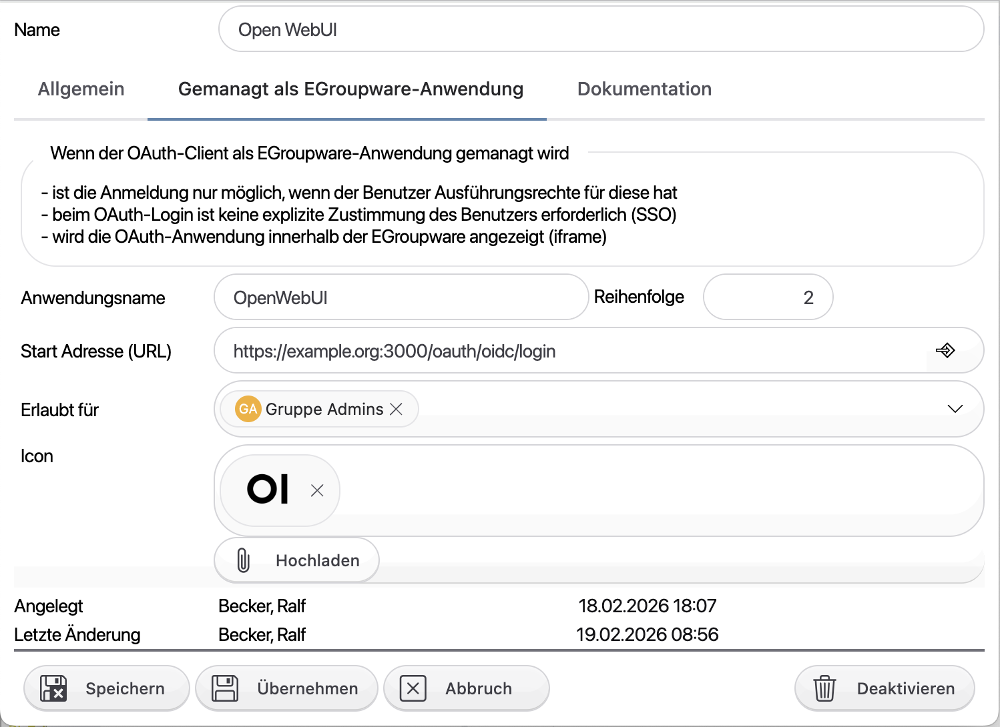
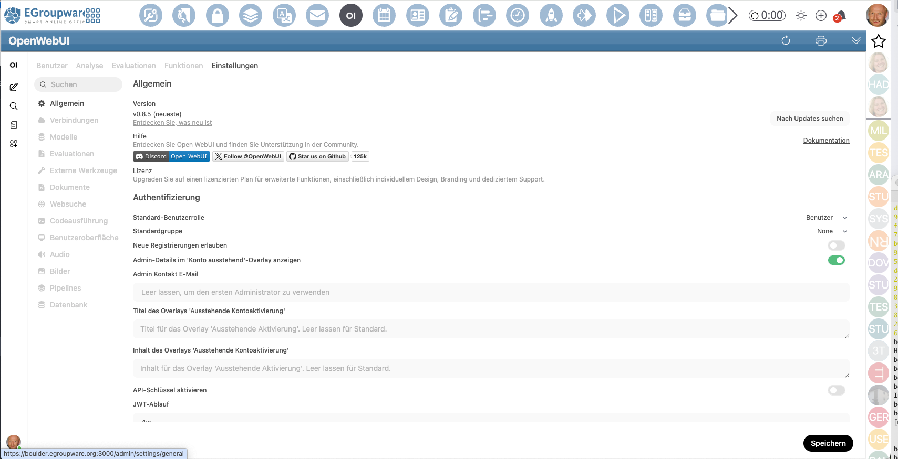
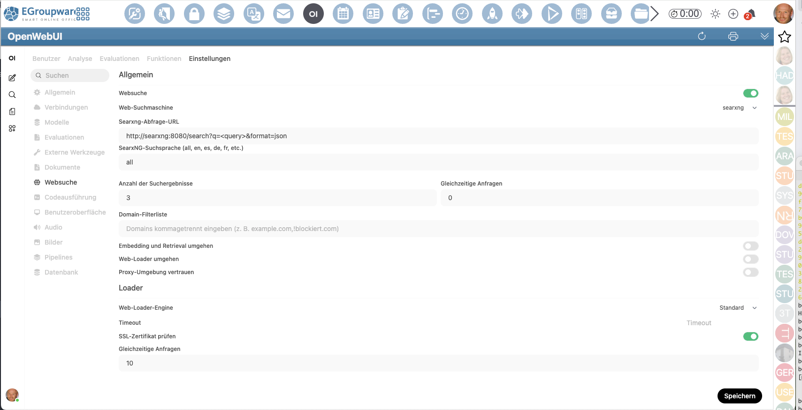

# Open WebUI integration into EGroupware

### ToDo's

- [x] OpenIDConnect: automatic authentication for EGroupware users/sessions
- [ ] Create OpenAPI description for EGroupware REST API to make it available as tools
- [ ] document the configuration steps inside Open WebUI

### OpenIDConnect integration
Create the following OpenIDConnect client in your EGroupware:


I used their official icon from https://docs.openwebui.com/images/logo.png

### docker-compose file
This configuration was inspired by an [article in German heise.de](https://www.heise.de/ratgeber/Web-Suche-fuer-die-lokale-KI-So-schliessen-Ihre-LLMs-Wissensluecken-11116805.html
)
```docker compose
services:
  # Open WebUI container
  openwebui:
    image: ghcr.io/open-webui/open-webui:main
    container_name: openwebui
    # done in nginx.conf now to support https
    #ports:
    #  - "3000:8080"
    volumes:
      - ./openwebui-data:/app/backend/data
    environment:
      - OLLAMA_BASE_URL=http://host.docker.internal:11434
      - WEBUI_URL=https://example.org:3000
      - CORS_ALLOW_ORIGIN=https://example.org
      - WEBUI_SECRET_KEY=<add some random secret here, to allow Open WebUI to encrypt it's stuff>
      # Required for OIDC
      - OAUTH_CLIENT_ID=openwebui
      - OAUTH_CLIENT_SECRET=<the secret of the client you created>
      - OPENID_PROVIDER_URL=https://example.org/.well-known/openid-configuration
      - ENABLE_OAUTH_SIGNUP=true
      # Optional but recommended
      - ENABLE_OAUTH_PERSISTENT_CONFIG=false
      #- OAUTH_PROVIDER_NAME=Your Provider Name
      - OAUTH_SCOPES=openid email profile groups roles
      - OPENID_REDIRECT_URI=https://example.org:3000/oauth/oidc/callback
      # For OAuth/SSO, you will probably have to use 'lax' (strict can break OAuth callbacks)
      - WEBUI_SESSION_COOKIE_SAME_SITE=lax
      - WEBUI_AUTH_COOKIE_SAME_SITE=lax
    restart: unless-stopped
    # use this to ease accessing Nginx running EGroupware
    extra_hosts:
    - "example.org:172.17.0.1"
    
  # Optional searxng container see heise.de article
  searxng:
    image: searxng/searxng:latest
    container_name: searxng
    ports:
      - "3002:8080"
    volumes:
      - ./searxng:/etc/searxng
    restart: unless-stopped
```

### Nginx proxy
As Open WebUI can NOT run under a prefix, I run it on a different port 3000, using the same domain and certificate as EGroupware:
```nginx configuration
server {
	# ssl config (enable following line plus either include or ssl_certificate* line)
	listen 3000 ssl;
	#include snippets/snakeoil.conf;	# requires ssl-certs package installed!
	# concatenate private key, certificate and intermediate certs to /etc/ssl/private/certificate.pem
	ssl_certificate /etc/ssl/private/certificate.pem;
	ssl_certificate_key /etc/ssl/private/certificate.pem;
	# HTTP Strict-Transport-Security header (start with a short max-age!)
	#add_header Strict-Transport-Security max-age=31536000;	# 31536000sec=1year

	server_name example.org;

    # Compression - EXCLUDE streaming content types
    gzip on;
    gzip_types text/plain text/css application/javascript image/svg+xml;
    # DO NOT include: application/json, text/event-stream

    # API endpoints - streaming optimized
    location /api/ {
        proxy_pass http://openwebui:8080;
        proxy_http_version 1.1;
        proxy_set_header Upgrade $http_upgrade;
        proxy_set_header Connection "upgrade";
        proxy_set_header Host $host;
        proxy_set_header X-Real-IP $remote_addr;
        proxy_set_header X-Forwarded-For $proxy_add_x_forwarded_for;
        proxy_set_header X-Forwarded-Proto $scheme;

        # CRITICAL: Disable all buffering for streaming
        gzip off;
        proxy_buffering off;
        proxy_request_buffering off;
        proxy_cache off;
        tcp_nodelay on;
        add_header X-Accel-Buffering "no" always;
        add_header Cache-Control "no-store" always;

        # Extended timeouts for LLM completions
        proxy_connect_timeout 1800;
        proxy_send_timeout 1800;
        proxy_read_timeout 1800;
    }

    # WebSocket endpoints
    location ~ ^/(ws/|socket\.io/) {
        proxy_pass http://openwebui:8080;
        proxy_http_version 1.1;
        proxy_set_header Upgrade $http_upgrade;
        proxy_set_header Connection "upgrade";

        gzip off;
        proxy_buffering off;
        proxy_cache off;

        # 24-hour timeout for persistent connections
        proxy_connect_timeout 86400;
        proxy_send_timeout 86400;
        proxy_read_timeout 86400;
    }

    # Static assets - CAN buffer and cache
    location /static/ {
        proxy_pass http://openwebui:8080;
        proxy_buffering on;
        proxy_cache_valid 200 7d;
        add_header Cache-Control "public, max-age=604800, immutable";
    }

    # Default location
    location / {
        proxy_pass http://openwebui:8080;
        proxy_http_version 1.1;
        proxy_set_header Host $host;
        proxy_set_header X-Real-IP $remote_addr;
        proxy_set_header X-Forwarded-For $proxy_add_x_forwarded_for;
        proxy_set_header X-Forwarded-Proto $scheme;
    }
}
```

### Open WebUI configuration
Configure Open WebUI: so new (by EGroupware authenticated) users don't need to be confirmed:

Configure Open WebUI to use local Ollama and IONOS AI Hub through EGroupware's AiProxy:

Configure SearXNG / web search in Open WebUI via searxng container / service
